CUDA Path Tracer
======================

**University of Pennsylvania, CIS 565: GPU Programming and Architecture, Project 2**

* Calvin Lieu
  * [LinkedIn](www.linkedin.com/in/calvin-lieu-91912927b)
* Tested on: Windows 11, i5-13450HX @ 2.40GHz 16GB, NVIDIA GeForce RTX 5050 Laptop GPU 8GB (Personal)

---
## Overview:

# CUDA Path Tracer

A GPU-accelerated Monte Carlo path tracer built with CUDA, featuring physically-based rendering, advanced material models, and real-time denoising.

## Showcase

|       Master Chief       |
| :----------------------: |
| 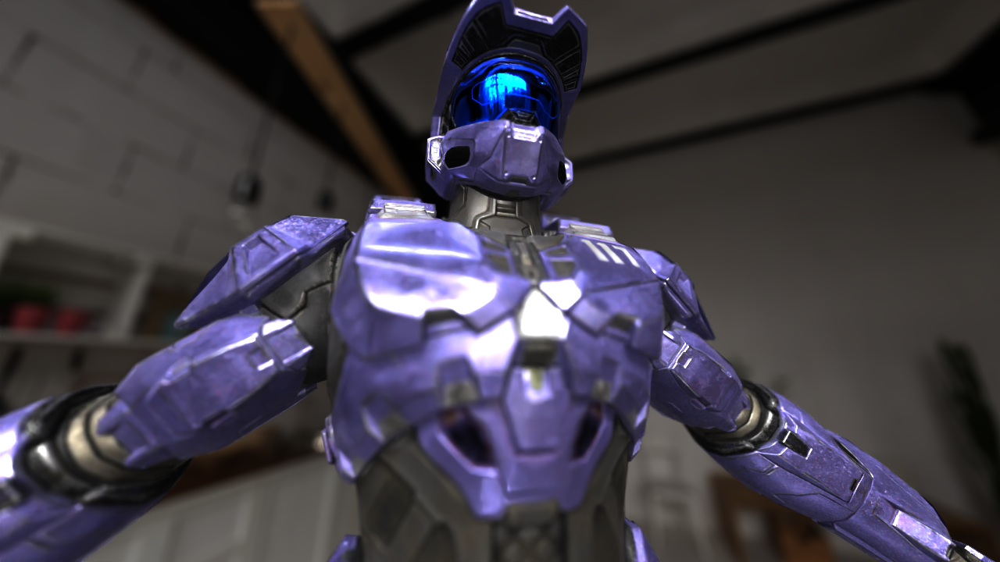 |

|             Dark Knight             |
| :---------------------------------: |
| 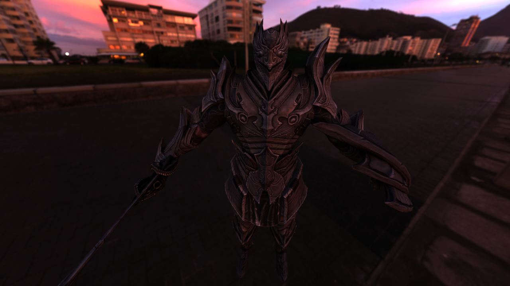 |

|           Goliath           |
| :-------------------------: |
| 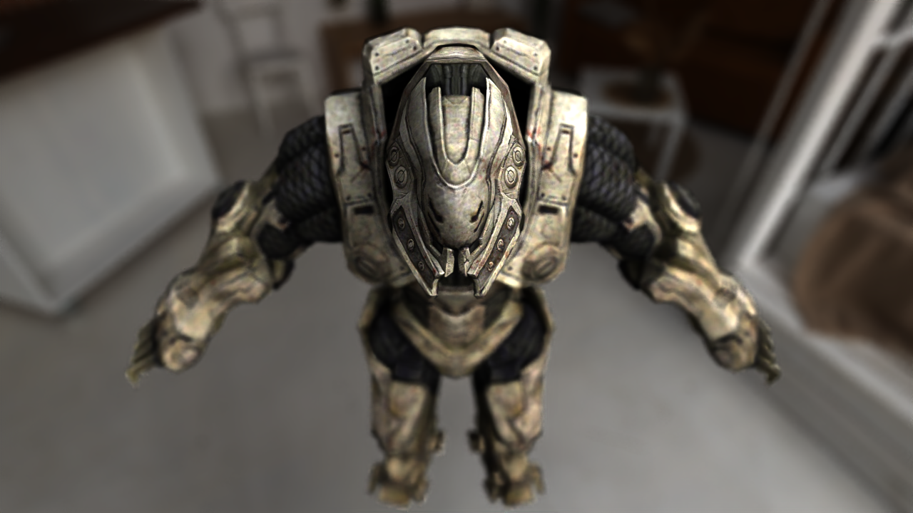 |

|                 BXDFs                  |
| :------------------------------------: |
|         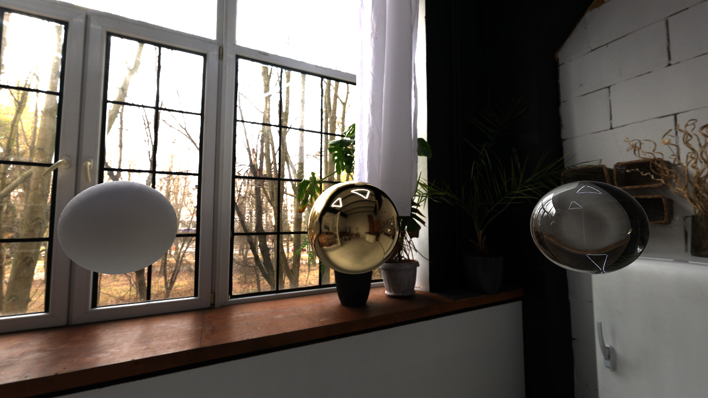          |

|   Master Chief in OG Green   |
| :--------------------------: |
| 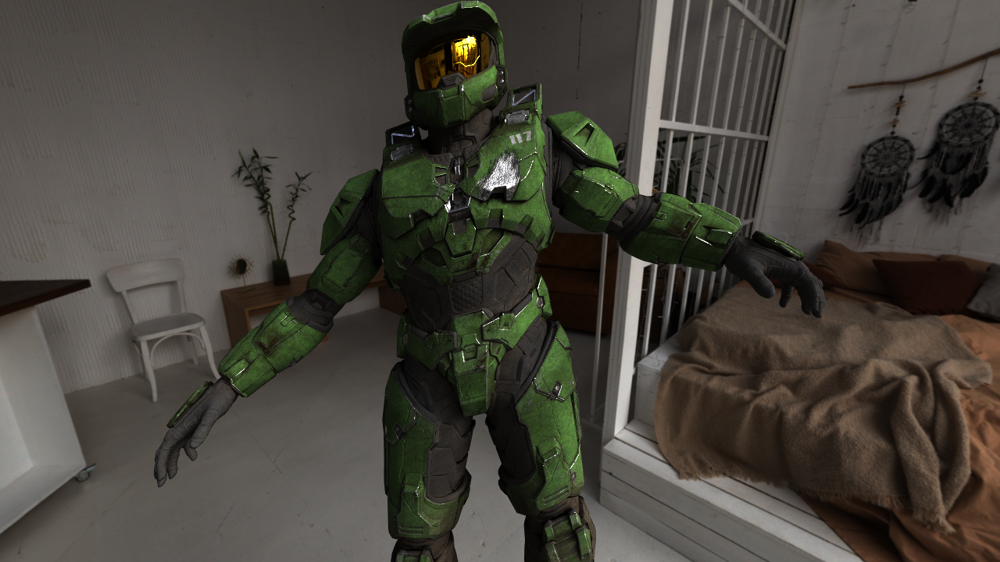 |
---
## Feature List
- Diffuse BSDF, Specular/GGX Microfacet BRDF
- Dielectric BTDF for refraction
- Depth of Field
- Direct Lighting with Next Event Estimation
- Environment Map Sampling (HDR)
- Texture mapping
- Tone Mapping (Reinhard, ACES)
- glTF Loading
- Material Sort
- Antialiasing
- Russian Roulette Path Termination
- BVH Acceleration
- Denoising
- Some glTF material extensions

## Controls

**Camera Movement:**
- `Left Mouse Button`: Rotate camera around look-at point
- `Right Mouse Button`: Zoom in/out (vertical drag)
- `Middle Mouse Button`: Pan look-at point in XZ plane
- `Space`: Reset camera to original position

**Rendering:**
- `S`: Save current image (auto-generates filename with timestamp and sample count)
- `ESC`: Save final image and exit application

**GUI Controls:**
- Material sorting toggle
- Russian Roulette path
- Direct Lighting
- BVH Acceleration
- Denoiser
- Exposure/Gamma Sliders
- Tone Mapping Mode
- Aperture
- Focal Distance

## Scene File Format

Scenes are defined in JSON format with the following structure:

### Camera Configuration
```json
{
    "Background": {
        "TYPE": "skybox",
        "PATH": "../scenes/environments/brown_photostudio_02_4k.hdr"
    },
    "Materials": {
        "default": {
            "TYPE": "Diffuse",
            "RGB": [ 1.0, 1.0, 1.0 ]
        }
    },
    "Camera": {
        "RES": [ 1280, 720 ],
        "FOVY": 35.0,
        "ITERATIONS": 5000,
        "DEPTH": 12,
        "FILE": "helmet_studio",
        "EYE": [ 0.0, 0.4, 1.5 ],
        "LOOKAT": [ 0.0, 0.3, 0.0 ],
        "UP": [ 0.0, 1.0, 0.0 ]
    },
    "Objects": [
        {
            "TYPE": "sphere",
            "MATERIAL": "default",
            "TRANS": [ -2.5, 0.0, 0.0 ],
            "ROTAT": [ 0.0, 0.0, 0.0 ],
            "SCALE": [ 1.0, 1.0, 1.0 ]
        },
        {
            "TYPE": "gltf",
            "FILE": "../scenes/models/blue_chief/scene.gltf",
            "MATERIAL": "white",
            "TRANS": [ 0.0, -12.5, 0.0 ],
            "ROTAT": [ 90.0, 180.0, 60.0 ],
            "SCALE": [ 10.0, 10.0, 10.0 ]
        }
    ]
}
```
---
### Core Path Tracing

#### Physically-Based Materials
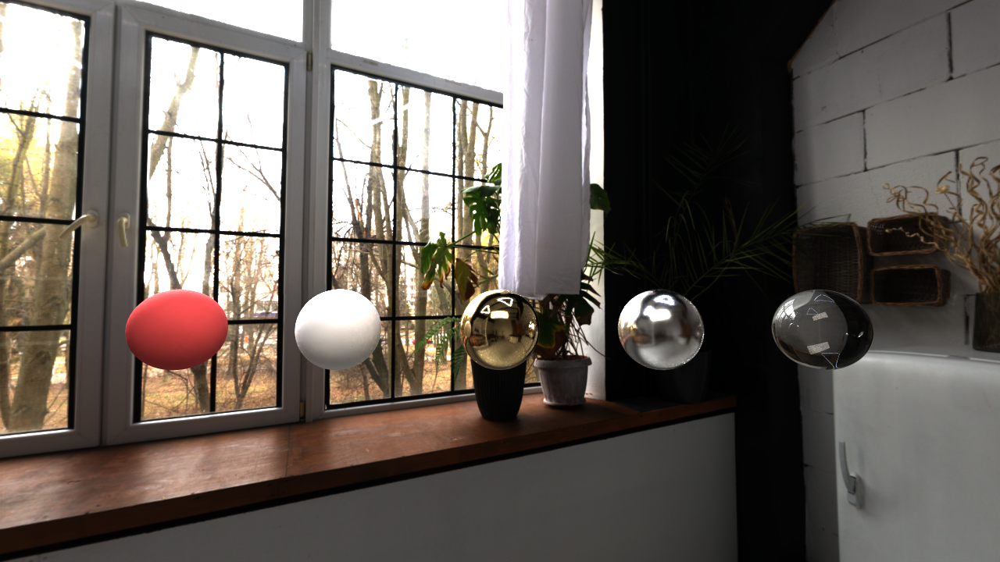

Multiple BSDF implementations: 2x Diffuse, Specular Reflection, Microfacet Reflection, Refraction
- **Lambertian Diffuse**: Cosine-weighted hemisphere sampling for perfectly diffuse surfaces
- **GGX Microfacet**: Cook-Torrance specular BRDF with importance sampling - Microfacet reflection needs tuning for higher roughness
- **Dielectric Transmission**: Fresnel-based refraction using Schlick's approximation for glass, water, and other transmissive materials with configurable index of refraction

#### Stochastic Antialiasing

Implements 4x4 stratified jitter sampling that cycles every 16 iterations. Distributes samples across a grid pattern within each pixel, reducing aliasing artifacts while maintaining unbiased Monte Carlo integration.

### Lighting & Sampling

#### Next Event Estimation (Direct Lighting)

Explicit direct lighting using multiple importance sampling. Combines BRDF importance sampling with light source sampling, using the balance heuristic to weight contributions. NB: Not entirely sure if this is working properly...

#### Environment Map Importance Sampling

HDR environment map lighting with importance sampling via precomputed CDFs. Builds marginal and conditional probability distributions for sampling bright regions of the skybox preferentially.

### Material System

#### PBR Texture Mapping

Full glTF 2.0 PBR texture support:
- **Base Color Textures**: Albedo/diffuse color maps
- **Metallic-Roughness Textures**: Packed metallic (B) and roughness (G) channels
- **Normal Mapping**: Tangent-space normal maps with TBN matrix construction
- **Emissive Textures**: Self-illuminating texture maps
- **Occlusion Textures**: Ambient occlusion maps with configurable strength

Texture fetches add overhead but dramatically improve visual quality.

#### glTF 2.0 Mesh Loading
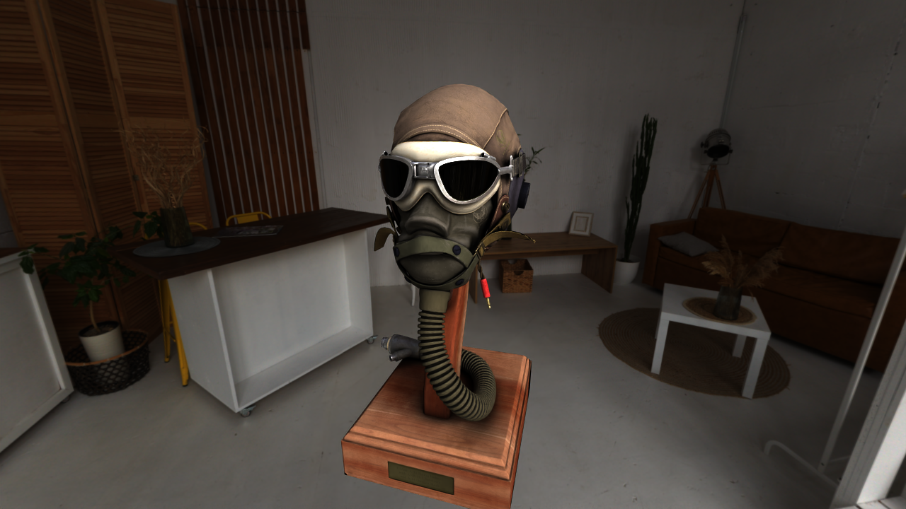

Complete glTF 2.0 scene loader supporting:
- Hierarchical scene graph traversal
- Node transformations (TRS decomposition)
- Triangle mesh primitives with indexed geometry
- Material property mapping
- Texture coordinate interpolation
- Tangent space calculation for normal mapping

Supports glTF extensions:
- `KHR_materials_transmission` - Refractive materials
- `KHR_materials_volume` - Subsurface parameters
- `KHR_materials_ior` - Custom index of refraction

### Post-Processing

#### Real-Time Denoising
|Without Denoising|With Denoising|
|---------|---------|
|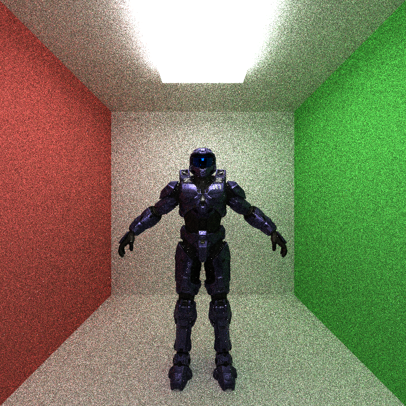|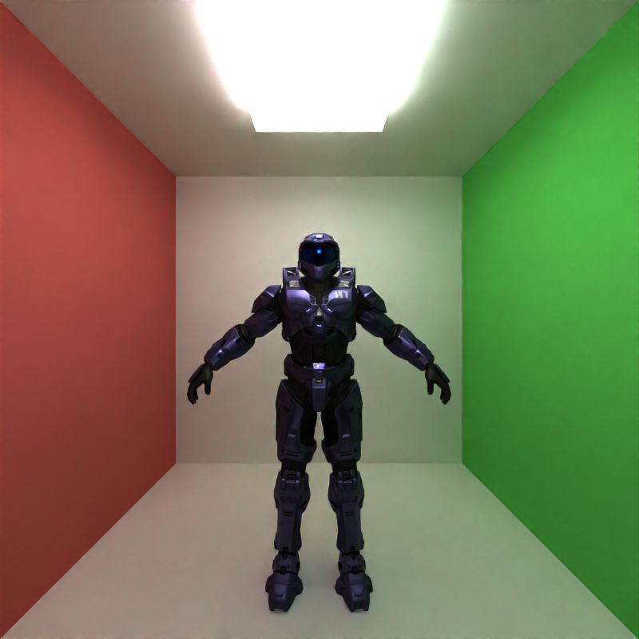|
*Left: Raw 50 spp | Right: Denoised 50 spp*

Integration of Intel Open Image Denoise (OIDN) running directly on CUDA device. Uses multiple feature buffers for improved quality:

**Buffers:**
- **Beauty**: Raw accumulated radiance (HDR)
- **Albedo**: First-hit surface color (averaged per iteration)
- **Normals**: First-hit world-space normals (averaged per iteration)

**Implementation:**
- Buffers accumulated separately throughout rendering
- Averaged before passing to denoiser
- Zero-copy shared buffers between CUDA and OIDN (no CPU transfer)
- Filter executes on GPU asynchronously

See Performance section for analysis.

#### Tone Mapping & Exposure Control
|None|Reinhard|ACES|
|---------|---------|---------|
|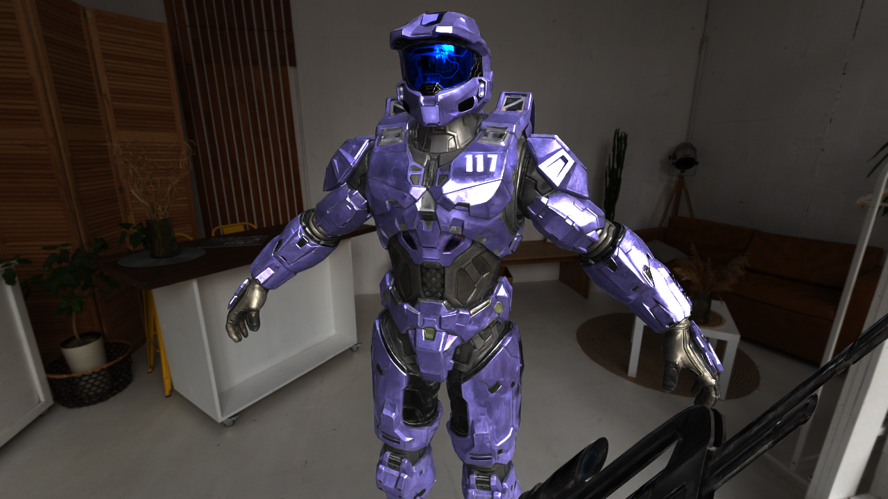|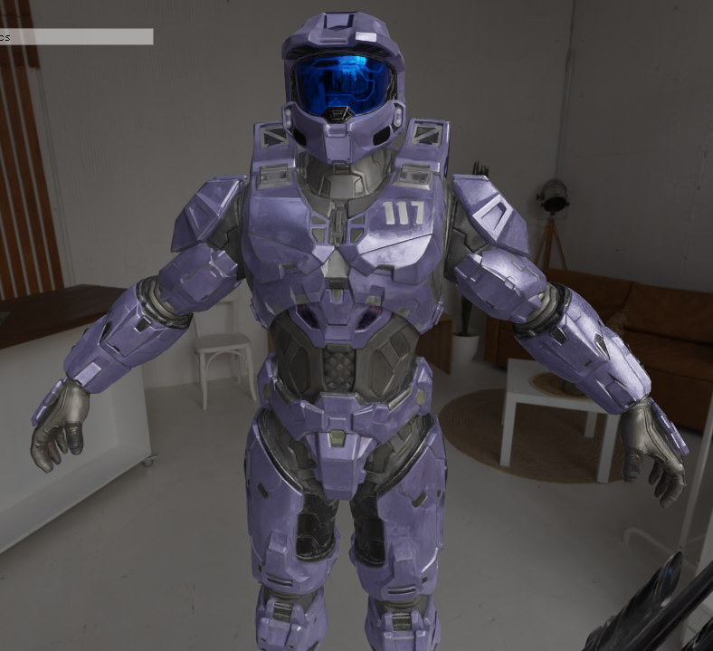|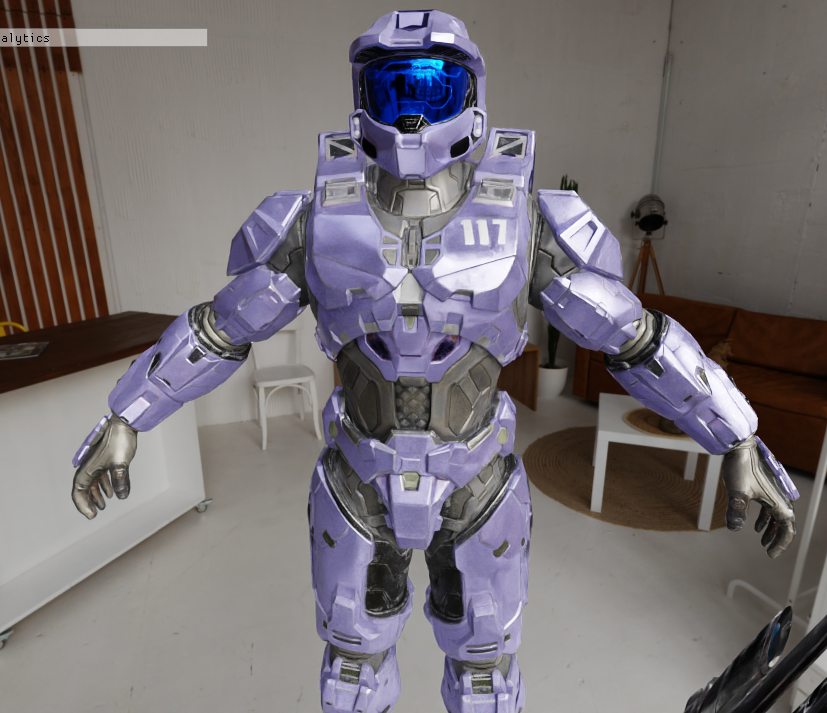|

HDR to LDR conversion with multiple tone mapping operators:

**Operators:**
- **None**: Linear mapping
- **Reinhard**: `L_out = L_in / (1 + L_in)` - Simple, preserves color ratios - a bit dark however, adjust gamma/exposure to achieve better result
- **ACES Filmic**: Industry-standard curve used in film production, handles highlights gracefully - a little bright?

**Controls:**
- Exposure adjustment: ±5 EV stops (multiply by `2^exposure`)
- Gamma correction: 1.0-2.4 (sRGB standard is 2.2)
- Real-time toggle between operators

All tone mapping happens in the final display kernel after accumulation.

### Camera Effects

#### Depth of Field
|With DOF|Without DOF|
|---------|---------|
|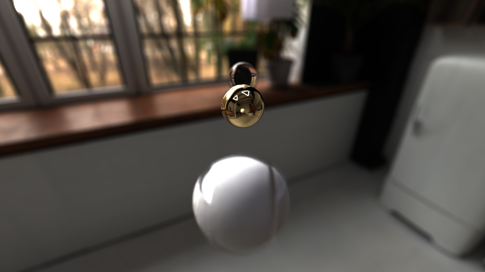|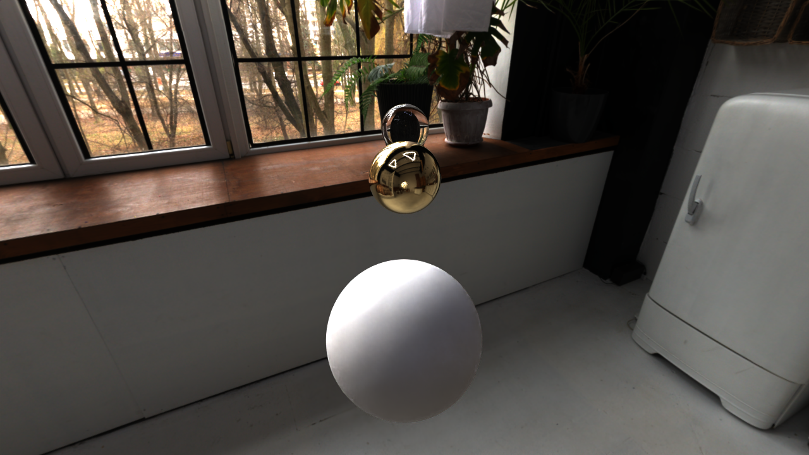|

Physically-based thin lens camera model simulating aperture and focal plane effects.

**Parameters:**
- **Lens Radius** (aperture): Controls blur amount
  - 0.0 = Pinhole (infinite depth of field)
  - Larger values = shallower depth of field
- **Focal Distance**: Distance to plane of sharp focus

**Implementation:**
- Sample point on lens using concentric disk mapping
- Cast ray from lens sample through focal point
- All rays converge at focal distance → sharp
- Objects at other distances blur proportionally

**f-number calculation:** `f = focal_distance / (2 × lens_radius)`

### Performance Analysis

This section analyzes the measured performance of the CUDA path tracer with reference to **GPU programming concepts**, focusing on the architectural principles that explain the observed trends.

---

#### Material Sorting
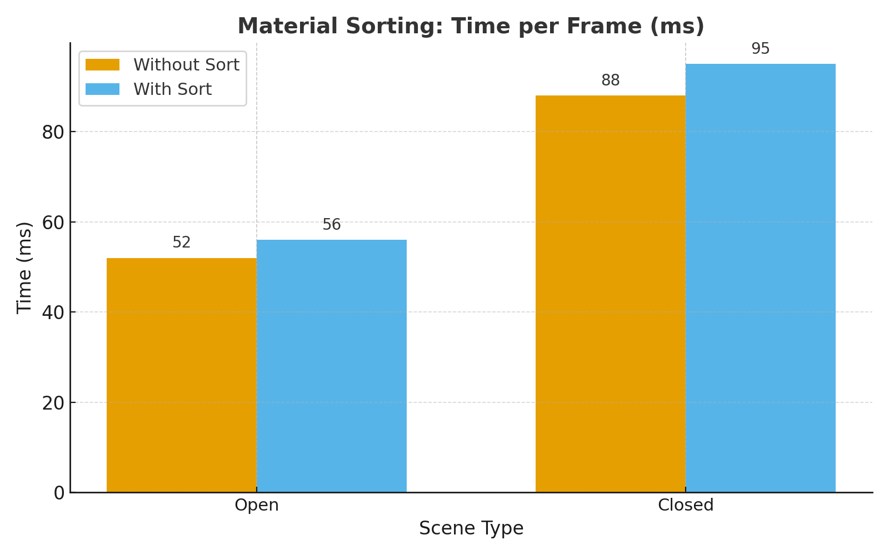

**Implementation:**
- Extract material IDs from intersection results
- Sort ray indices by material ID using `thrust::sort_by_key`
- Gather rays and intersections into sorted order
- Execute shading kernel on sorted data

**Performance Impact:**
Material sorting is designed to improve **warp coherence** during shading:
- Threads in the same warp process similar BRDFs → fewer divergent branches.

However, the sorting itself (`thrust::sort_by_key` + `thrust::gather`) introduces an **O(N log N)** overhead per bounce, adding multiple global memory passes.
- Sorting improves control-flow coherence but breaks spatial locality.
- In small or simple workloads, GPU warp occupancy is already high, so sorting overhead dominates.

**Result:**  
Slight performance loss (4–8%) — expected in low-material-count scenes.

#### Russian Roulette Path Termination
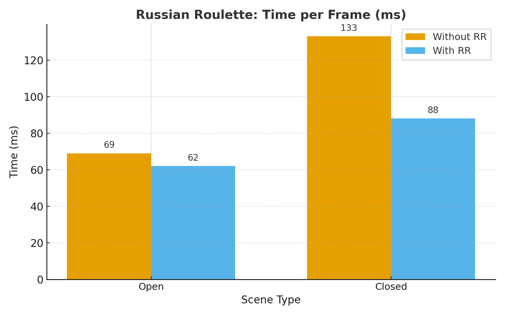

Stochastic early termination of low-contribution paths. Paths with low throughput are probabilistically terminated while remaining paths are weighted to maintain unbiased results.

**Algorithm:**
- Starts at bounce depth 3
- Survival probability = `clamp(max(throughput), 0.2, 0.95)`
- Surviving paths scaled by `1.0 / survival_probability`

**Performance:**
On the GPU:
- Fewer rays → less total computation.
- But terminated rays cause **warp underutilization**, since inactive threads still occupy lanes.

**Open scenes** (with fewer bounces) gain little because rays typically escape quickly.  
**Closed scenes** (with many reflections) gain significantly as RR prunes deep, low-energy paths.

**GPU tradeoff:**
- Reduces global memory writes and ALU instructions.
- May create *irregular control flow*, impacting SIMD efficiency.

**Result:**  
10% speedup for open and ~34% for closed scenes matches expected RR impact — greater savings in bounce-heavy environments.

#### BVH Acceleration Structure
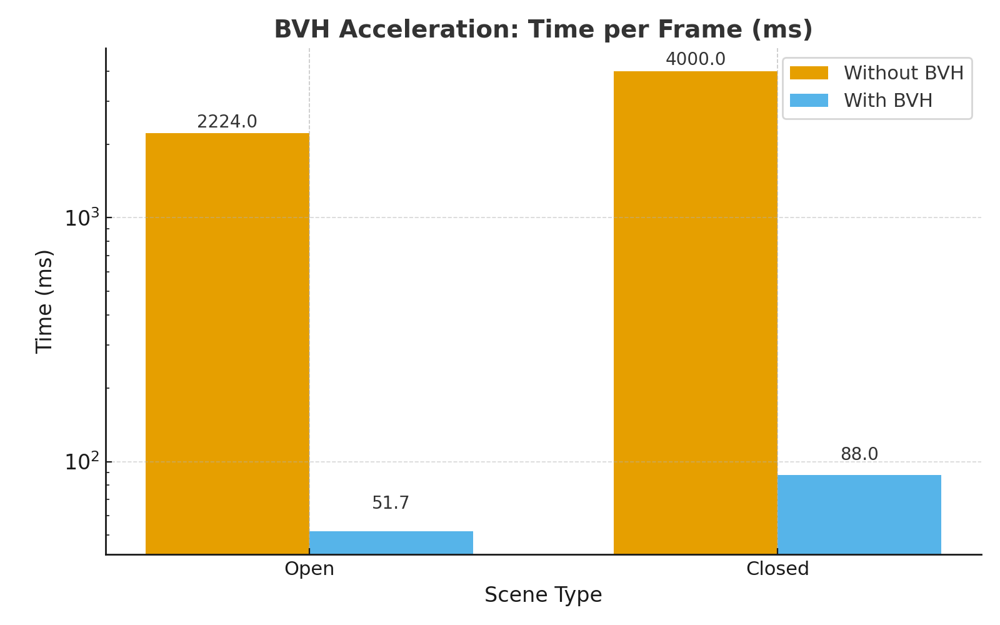

Bounding Volume Hierarchy for accelerated ray-scene intersection testing. Binary tree built on CPU.

**Implementation:**
- Recursive top-down construction
- Each node stores AABB bounds and child pointers
- Leaf nodes contain primitive lists (triangles or geometry)
- GPU traversal uses explicit 64-element stack (no recursion)

The **Bounding Volume Hierarchy (BVH)** drastically reduces per-ray intersection cost from *O(N)* to *O(log N)*.  
Without BVH, each ray must test every object in the scene, leading to:
- **Severe branch divergence** across warps (rays traverse different objects).
- **Uncoalesced global memory access**.
- Poor **SIMT (Single Instruction, Multiple Thread)** utilization.

BVH traversal restores **spatial coherence**, since nearby rays traverse similar node paths.  
This improves:
- **Warp execution efficiency**.
- **Cache locality** for geometry data.
- **Memory coalescing** during traversal.

**Result:**  
The massive 40×+ acceleration (2224 → 51.7 ms open, 4000 → 88 ms closed) is expected and demonstrates how BVH structures align perfectly with the GPU’s SIMT model.
Benefit scales with scene complexity.

#### Denoiser Performance
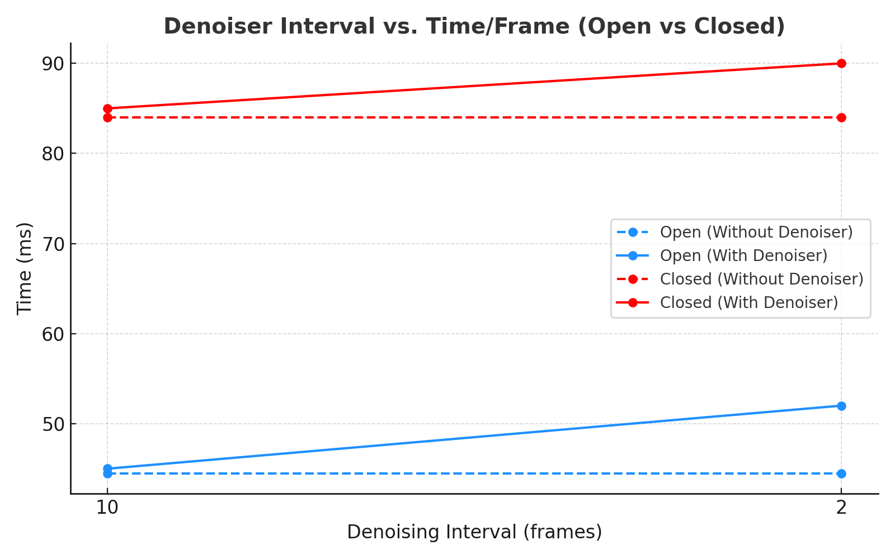

The **denoiser** adds an additional CUDA kernel (via OIDN) that reads and writes full-resolution float3 buffers (color, normal, albedo).  
This workload is:
- **Bandwidth-bound**, not compute-bound.
- Dominated by **global memory traffic** and **synchronization overhead**.

At shorter intervals (denoising every 2 frames), GPU bandwidth is stressed more often, explaining the 5–6 ms slowdown in closed scenes and minor 1–2 ms slowdown in open scenes.

The OIDN filter efficiently uses CUDA streams to overlap work, but since it performs multiple full-frame memory passes, it scales with **memory bandwidth**, not SM throughput.

**Result:**  
The denoiser’s overhead is small but measurable — higher for complex (closed) scenes due to larger spatial frequency content. The improvement in image quality however, is well worth the performance tradeoff.

## Third-Party Code & Libraries

This project uses the following third-party libraries:

- **[tinygltf](https://github.com/syoyo/tinygltf)** - glTF 2.0 file loading and parsing
- **[stb_image](https://github.com/nothings/stb)** - Image loading for textures and HDR environment maps  
- **[Intel Open Image Denoise](https://www.openimagedenoise.org/)** - AI-accelerated denoising
- **[Dear ImGui](https://github.com/ocornut/imgui)** - Immediate mode GUI for controls
- **[GLM](https://github.com/g-truc/glm)** - OpenGL mathematics library
- **[CUDA Thrust](https://thrust.github.io/)** - Parallel algorithms and primitives
- **[GLFW](https://www.glfw.org/)** - Window and input handling
- **[GLEW](http://glew.sourceforge.net/)** - OpenGL extension loading

### Third-Party Assets

- HDR environment maps from [Poly Haven](https://polyhaven.com/)
- 3D models from [Sketchfab](https://sketchfab.com/)

All third-party code and assets are used in accordance with their respective licenses.
